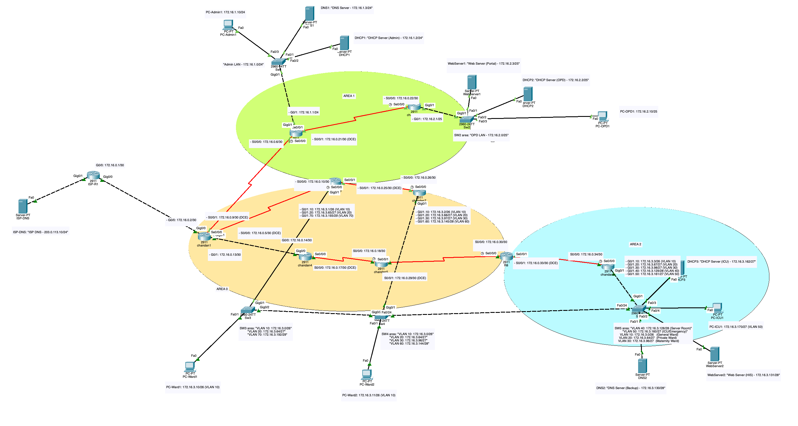

# Fishtail Hospital Network Design and Implementation

## Project Information

| Field | Details |
|-------|---------|
| **Project Title** | Network Design and Implementation for Fishtail Hospital |
| **Student** | Chandan Kumar Shah |
| **Roll Number** | 080BCT023 |
| **Course** | CT 654 — Computer Networks |
| **Institution** | Institute of Engineering, Pulchowk Campus, Tribhuvan University |
| **Tool** | Cisco Packet Tracer 8.x |
| **Date** | April 2026 |

---

## Abstract

This project presents a comprehensive enterprise network design and implementation for Fishtail Hospital, a multi-department healthcare facility. The network architecture incorporates industry-standard protocols and best practices including multi-area OSPF routing, VLAN segmentation for department isolation, Variable Length Subnet Masking (VLSM) for efficient IP address utilization, and centralized network services. The design ensures scalability, security, and high availability across all hospital departments while maintaining connectivity to external ISP services.

---

## Table of Contents

1. [Network Topology](#network-topology)
2. [Project Requirements](#project-requirements)
3. [Network Architecture](#network-architecture)
4. [Device Inventory](#device-inventory)
5. [OSPF Multi-Area Configuration](#ospf-multi-area-configuration)
6. [IP Addressing Scheme](#ip-addressing-scheme)
7. [VLAN Configuration](#vlan-configuration)
8. [Network Services](#network-services)
9. [Security Implementation](#security-implementation)
10. [Connectivity Verification](#connectivity-verification)
11. [Repository Contents](#repository-contents)
12. [Usage Instructions](#usage-instructions)

---

## Network Topology

The following diagram illustrates the complete network topology implemented in Cisco Packet Tracer. The topology is organized into three OSPF areas with color-coded regions: Area 0 (Backbone), Area 1 (Administrative/Clinical), and Area 2 (Server/ICU).



**Topology Highlights:**
- **Yellow Region (Area 0):** Backbone area containing core and transit routers (Chandan1, Chandan4, Chandan5)
- **Green Region (Area 1):** Administrative and clinical departments (Admin LAN, OPD LAN, Ward floors)
- **Blue Region (Area 2):** Critical infrastructure including Server Room and ICU/Emergency

---

## Project Requirements

The following table summarizes all course requirements and their implementation status:

| Requirement | Status | Implementation Details |
|-------------|--------|------------------------|
| Minimum 10 routers | Completed | 10 routers deployed (ISP-R1 + Chandan1 through Chandan9) |
| At least 3 transit routers | Completed | Chandan4, Chandan5, and Chandan8 serve as transit routers |
| ISP router with external connectivity | Completed | ISP-R1 configured with public network 203.0.113.0/24 |
| Minimum 9 LANs with 6 different subnet sizes | Completed | 9 department LANs + 9 point-to-point links using 6 prefix lengths |
| OSPF multi-area with minimum 3 areas | Completed | Area 0 (Backbone), Area 1, and Area 2 configured |
| Minimum 7 VLANs | Completed | VLANs 10, 20, 30, 40, 50, 60, and 70 implemented |
| At least 2 VLANs spanning 3+ switches | Completed | VLAN 10 and VLAN 20 span SW3, SW4, and SW5 |
| Minimum 3 DNS servers | Completed | DNS1, DNS2, and ISP-DNS deployed |
| Minimum 2 Web servers | Completed | WebServer1 (Portal) and WebServer2 (HIS) configured |
| Minimum 3 DHCP servers | Completed | DHCP1, DHCP2, and DHCP3 serving respective zones |
| Router security with passwords and telnet | Completed | All 9 internal routers secured with console, enable, and VTY passwords |
| Router naming convention | Completed | Routers named Chandan1 through Chandan9 |
| VLSM addressing | Completed | Six different prefix lengths utilized (/24, /25, /26, /27, /28, /29) |
| Interface labeling | Completed | All IP addresses labeled in Packet Tracer topology |

---

## Network Architecture

### Hierarchical Design

The network follows a hierarchical model with clear separation of concerns:

| Layer | Components | Function |
|-------|------------|----------|
| **Core** | Chandan1 (ASBR) | Central routing, ISP connectivity, default route redistribution |
| **Distribution** | Chandan2, Chandan3, Chandan4, Chandan5, Chandan8 | Inter-area routing, traffic aggregation |
| **Access** | Chandan6, Chandan7, Chandan9, SW1-SW5 | End-device connectivity, VLAN assignment |

### Router Roles

| Router | Role | Description |
|--------|------|-------------|
| ISP-R1 | ISP Gateway | Provides external connectivity with public IP space |
| Chandan1 | ASBR (Autonomous System Boundary Router) | Redistributes default route from ISP into OSPF |
| Chandan3 | ABR (Area Border Router) | Connects Area 0 and Area 1 |
| Chandan8 | ABR (Area Border Router) | Connects Area 0 and Area 2 |
| Chandan4, Chandan5 | Transit Routers | Provide backbone connectivity in Area 0 |
| Chandan2 | Admin Gateway | Serves Administration LAN |
| Chandan6 | OPD Gateway | Serves Outpatient Department LAN |
| Chandan7 | Ward Gateway | Serves Ward Floor 2 VLANs |
| Chandan9 | Server/ICU Gateway | Serves Server Room and ICU VLANs |

---

## Device Inventory

| Device Type | Model | Quantity | Specific Devices |
|-------------|-------|----------|------------------|
| Routers | Cisco 2911 | 10 | ISP-R1, Chandan1–Chandan9 |
| Switches | Cisco 2960-24TT | 5 | SW1, SW2, SW3, SW4, SW5 |
| Servers | Server-PT | 8 | DNS1, DNS2, ISP-DNS, DHCP1, DHCP2, DHCP3, WebServer1, WebServer2 |
| Workstations | PC-PT | 5 | PC-Admin1, PC-OPD1, PC-Ward1, PC-Ward2, PC-ICU1 |
| **Total** | — | **28** | — |

---

## OSPF Multi-Area Configuration

### Area Assignment

| OSPF Area | Area Type | Routers | Purpose |
|-----------|-----------|---------|---------|
| Area 0 | Backbone | Chandan1, Chandan3, Chandan4, Chandan5, Chandan8 | Core transit and inter-area routing |
| Area 1 | Standard | Chandan2, Chandan3, Chandan6, Chandan7 | Administration, OPD, and Ward departments |
| Area 2 | Standard | Chandan8, Chandan9 | Server Room and ICU/Emergency |

### OSPF Design Rationale

1. **Area Segmentation:** Splitting the network into multiple areas contains LSA flooding within each area, reducing routing overhead and improving convergence time.

2. **Area Border Routers:** Chandan3 and Chandan8 summarize routes between areas, providing a clean routing table structure.

3. **Default Route Redistribution:** Chandan1 redistributes the static default route (0.0.0.0/0) from ISP-R1 into OSPF using the `default-information originate` command.

### Sample OSPF Configuration (Chandan1)

```
router ospf 1
 router-id 1.1.1.1
 network 172.16.0.0 0.0.0.3 area 0
 network 172.16.0.4 0.0.0.3 area 1
 network 172.16.0.8 0.0.0.3 area 1
 network 172.16.0.12 0.0.0.3 area 0
 default-information originate
```

---

## IP Addressing Scheme

### Assigned IP Block

**Network Block:** 172.16.0.0/22  
**Total Addresses:** 1,024  
**Addresses Utilized:** Approximately 612  
**Reserved for Expansion:** Approximately 412

### Point-to-Point Links

All router interconnections use /30 subnets (2 usable host addresses each):

| Link | Network | Router A | Router B |
|------|---------|----------|----------|
| ISP-R1 to Chandan1 | 172.16.0.0/30 | 172.16.0.1 | 172.16.0.2 |
| Chandan1 to Chandan2 | 172.16.0.4/30 | 172.16.0.5 | 172.16.0.6 |
| Chandan1 to Chandan3 | 172.16.0.8/30 | 172.16.0.9 | 172.16.0.10 |
| Chandan1 to Chandan4 | 172.16.0.12/30 | 172.16.0.13 | 172.16.0.14 |
| Chandan4 to Chandan5 | 172.16.0.16/30 | 172.16.0.17 | 172.16.0.18 |
| Chandan2 to Chandan6 | 172.16.0.20/30 | 172.16.0.21 | 172.16.0.22 |
| Chandan3 to Chandan7 | 172.16.0.24/30 | 172.16.0.25 | 172.16.0.26 |
| Chandan5 to Chandan8 | 172.16.0.28/30 | 172.16.0.29 | 172.16.0.30 |
| Chandan8 to Chandan9 | 172.16.0.32/30 | 172.16.0.33 | 172.16.0.34 |

### LAN Subnets (VLSM)

| Department | VLAN | Subnet | Gateway | Usable Hosts | Prefix |
|------------|------|--------|---------|--------------|--------|
| Administration | — | 172.16.1.0/24 | 172.16.1.1 | 254 | /24 |
| Outpatient Department (OPD) | — | 172.16.2.0/25 | 172.16.2.1 | 126 | /25 |
| General Ward | 10 | 172.16.3.0/26 | 172.16.3.1 | 62 | /26 |
| Private Ward | 20 | 172.16.3.64/27 | 172.16.3.65 | 30 | /27 |
| Maternity Ward | 30 | 172.16.3.96/27 | 172.16.3.97 | 30 | /27 |
| Server Room | 40 | 172.16.3.128/28 | 172.16.3.129 | 14 | /28 |
| Laboratory | 60 | 172.16.3.144/28 | 172.16.3.145 | 14 | /28 |
| ICU / Emergency | 50 | 172.16.3.160/27 | 172.16.3.161 | 30 | /27 |
| Pharmacy | 70 | 172.16.3.192/29 | 172.16.3.193 | 6 | /29 |
| ISP Public Network | — | 203.0.113.0/24 | 203.0.113.1 | 254 | /24 |

### VLSM Design Rationale

Variable Length Subnet Masking allows efficient utilization of the assigned IP block by allocating subnet sizes proportional to department requirements. The Administration department requires the largest subnet (/24 with 254 hosts), while Pharmacy requires only 6 hosts (/29). This approach conserves approximately 40% of the address space for future expansion.

---

## VLAN Configuration

### VLAN Summary

| VLAN ID | Name | Subnet | Switch Coverage |
|---------|------|--------|-----------------|
| 10 | General-Ward | 172.16.3.0/26 | SW3, SW4, SW5 |
| 20 | Private-Ward | 172.16.3.64/27 | SW3, SW4, SW5 |
| 30 | Maternity-Ward | 172.16.3.96/27 | SW4, SW5 |
| 40 | Server-Room | 172.16.3.128/28 | SW5 |
| 50 | ICU-Emergency | 172.16.3.160/27 | SW5 |
| 60 | Laboratory | 172.16.3.144/28 | SW4 |
| 70 | Pharmacy | 172.16.3.192/29 | SW3 |

### Trunk Links

| Source | Destination | Link Type |
|--------|-------------|-----------|
| SW3 Gig0/2 | SW4 Gig0/2 | 802.1Q Trunk |
| SW4 Fa0/24 | SW5 Fa0/24 | 802.1Q Trunk |

### Inter-VLAN Routing

Router-on-a-stick configuration using 802.1Q subinterfaces:

| Router | VLANs Handled | Connected Switch |
|--------|---------------|------------------|
| Chandan3 | VLAN 10, 20, 70 | SW3 |
| Chandan7 | VLAN 10, 20, 30, 60 | SW4 |
| Chandan9 | VLAN 10, 20, 30, 40, 50 | SW5 |

### Sample Router-on-a-Stick Configuration (Chandan3)

```
interface GigabitEthernet0/1
 no shutdown
!
interface GigabitEthernet0/1.10
 encapsulation dot1Q 10
 ip address 172.16.3.1 255.255.255.192
!
interface GigabitEthernet0/1.20
 encapsulation dot1Q 20
 ip address 172.16.3.65 255.255.255.224
!
interface GigabitEthernet0/1.70
 encapsulation dot1Q 70
 ip address 172.16.3.193 255.255.255.248
```

---

## Network Services

### DNS Servers

| Server | IP Address | Location | Function |
|--------|------------|----------|----------|
| DNS1 | 172.16.1.3 | Admin LAN (SW1) | Primary DNS for hospital.local domain |
| DNS2 | 172.16.3.130 | Server Room (SW5, VLAN 40) | Backup DNS server |
| ISP-DNS | 203.0.113.10 | ISP Network | External/Internet DNS resolution |

**DNS Record:** `hospital.local` resolves to `172.16.2.3` (WebServer1)

### DHCP Servers

| Server | IP Address | Pool Range | Gateway | Serves |
|--------|------------|------------|---------|--------|
| DHCP1 | 172.16.1.2 | 172.16.1.20 – 172.16.1.119 | 172.16.1.1 | Admin LAN |
| DHCP2 | 172.16.2.2 | 172.16.2.20 – 172.16.2.69 | 172.16.2.1 | OPD LAN |
| DHCP3 | 172.16.3.162 | 172.16.3.175 – 172.16.3.190 | 172.16.3.161 | ICU (VLAN 50) |

DHCP relay (`ip helper-address`) is configured on gateway routers to forward DHCP requests to the appropriate server.

### Web Servers

| Server | IP Address | URL | Purpose |
|--------|------------|-----|---------|
| WebServer1 | 172.16.2.3 | http://hospital.local | Public Hospital Portal |
| WebServer2 | 172.16.3.131 | Internal access only | Hospital Information System (HIS) |

---

## Security Implementation

The following security measures are applied to all internal routers (Chandan1 through Chandan9):

| Security Feature | Configuration |
|------------------|---------------|
| Console Password | `cisco` |
| Enable Secret | `class` (encrypted) |
| VTY Password | `network` |
| Password Encryption | `service password-encryption` enabled |
| Remote Access | Telnet enabled on VTY lines 0-4 |

### Sample Security Configuration

```
enable secret class
service password-encryption
!
line console 0
 password cisco
 login
!
line vty 0 4
 password network
 login
 transport input telnet
```

### Telnet Verification

From PC-Admin1: `telnet 172.16.1.1`  
Login password: `network`  
Enable password: `class`

---

## Connectivity Verification

All connectivity tests were performed from PC-Admin1 (172.16.1.10):

| Test Description | Destination | Result | Notes |
|------------------|-------------|--------|-------|
| Gateway Reachability | 172.16.1.1 | Pass | 0% packet loss |
| Cross-Area OSPF (to OPD) | 172.16.2.10 | Pass | Route marked as O IA |
| Cross-VLAN (to Ward) | 172.16.3.10 | Pass | Inter-VLAN routing functional |
| Cross-Area to ICU | 172.16.3.170 | Pass | Area 1 to Area 2 communication |
| ISP Connectivity | 203.0.113.10 | Pass | External routing via default route |
| DNS Resolution | hospital.local | Pass | Resolved to 172.16.2.3 |

**Note:** Initial packet loss (25-50% on first ping) is expected in Packet Tracer due to ARP resolution and OSPF convergence delays. Subsequent pings show 0% loss.

---

## Repository Contents

| File | Description |
|------|-------------|
| `final_project.pkt` | Cisco Packet Tracer project file containing the complete network simulation |
| `project.md` | Comprehensive project documentation with all technical details |
| `report.tex` | LaTeX source file for the formal academic report |
| `topology.png` | High-resolution network topology diagram |
| `emblem.png` | Institution emblem for report documentation |
| `README.md` | This documentation file |

---

## Usage Instructions

### Prerequisites

- Cisco Packet Tracer version 8.x or later
- Available from [Cisco Networking Academy](https://www.netacad.com/courses/packet-tracer)

### Opening the Project

1. Launch Cisco Packet Tracer
2. Navigate to File → Open
3. Select `final_project.pkt`
4. Wait for the simulation to load completely

### Testing the Network

1. **Ping Test:** Click on any PC, go to Desktop → Command Prompt, and use the `ping` command
2. **Web Access:** Open Web Browser on any PC and navigate to `http://hospital.local`
3. **Telnet Test:** From Command Prompt, use `telnet <router-ip>` to test remote access
4. **DHCP Test:** Set any PC to obtain IP automatically and verify address assignment

### Viewing Configurations

1. Click on any router or switch
2. Navigate to the CLI tab
3. Enter `enable` and then `show running-config` to view the current configuration

---

## Design Considerations

### Scalability

The network design accommodates future growth through:
- Reserved IP address space (approximately 412 addresses)
- Modular OSPF area structure allowing additional areas
- VLAN-capable switches supporting additional department segmentation

### Reliability

- Multiple OSPF paths provide redundancy for inter-area traffic
- Distributed DNS and DHCP servers ensure service availability
- Hierarchical design isolates failures to specific network segments

### Security

- Password protection on all network devices
- VLAN segmentation isolates sensitive departments (ICU, Server Room)
- Controlled ISP connectivity through a single ASBR

---

## References

1. Cisco Networking Academy. (2024). *CCNA Routing and Switching*.
2. Odom, W. (2023). *CCNA 200-301 Official Cert Guide*. Cisco Press.
3. Institute of Engineering. (2026). *CT 654 Computer Networks Course Guidelines*.

---

**Author:** Chandan Kumar Shah  
**Roll Number:** 080BCT023  
**Institution:** Institute of Engineering, Pulchowk Campus, Tribhuvan University  
**Course:** CT 654 — Computer Networks  
**Submission Date:** April 2026
